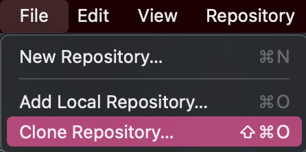
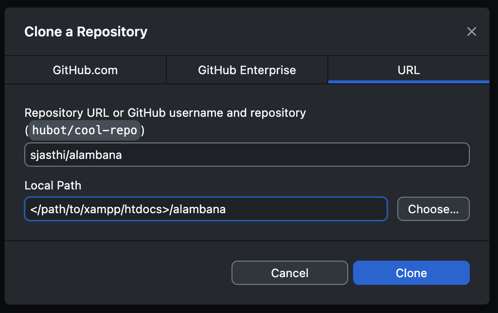
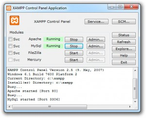
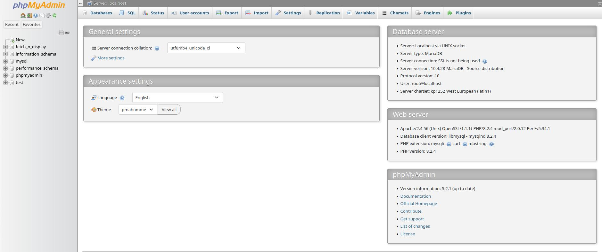
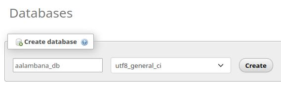
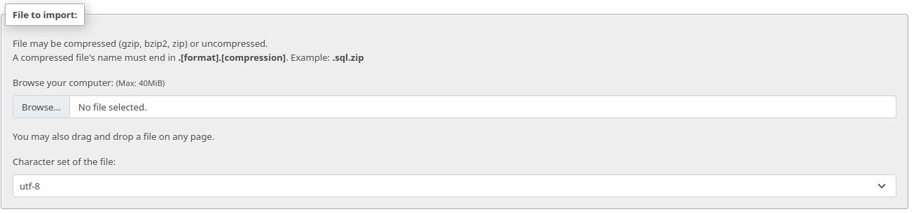

<h1 style="text-align: center;">Alambana Deployment Instructions</h1>

## Install Xampp
Navigate to the [xampp download page](https://www.apachefriends.org/index.html)<br>
<br>
Select the download for your operating system<br>
run the installation program<br>
## Clone the repository
[github repo](https://github.com/sjasthi/alambana)
### Cli
```bash
git clone https://github.com/sjasthi/alambana.git </path/to/xampp/htdocs/alambana>
```
### Github Desktop(Gui)
click **File** in the application menubar -> **Clone Repository**<br>


in the popup window select **URL** <br>
paste ``sjasthi/alambana`` in the **Repository URL** box <br>
paste ``</path/to/xampp/htdocs>/alambana`` in the **Local Path** box<br>



## Start Xampp
### Cli
```bash
xampp start
```
### Gui
open xampp click the start button next to apache and mysql<br>


## Configure MySql
Navigate to [phpMyAdmin control panel](http://localhost/phpmyadmin/index.php)

Navigate to the [import page](http://localhost/phpmyadmin/index.php?route=/server/import) located on the topbar

<br>
create a database named: `aalambana_db` with the collation: `utf8_general_ci` 


select browse and find the file `aalambana_db.sql` located in the github repo at `xampp/htdocs/alambana/sql/aalambana_db.sql` and then click import at the bottom of the page

## Finishing up
you can now view the deployed page here: [alambana](http://localhost/alambana) 

